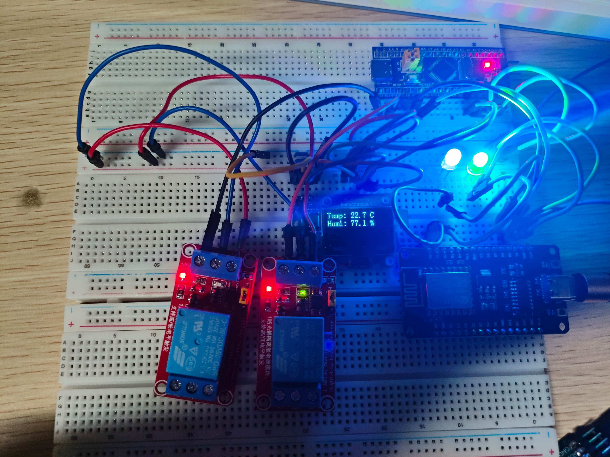
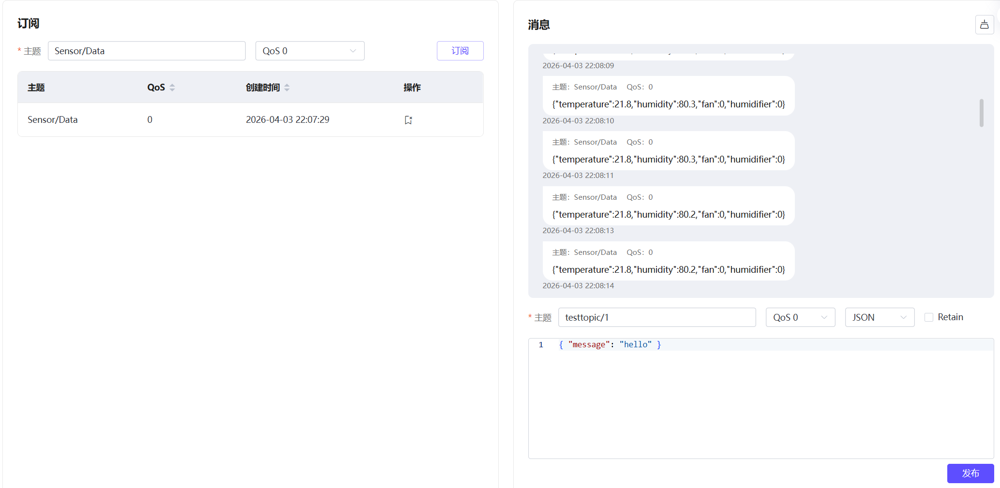

# STM32+ESP8266+QT6的智能家居环境监测与控制系统（练手小项目）

## 1.元件列表

|     名称      | 连接方式 |
| :-----------: | :------: |
| STM32F103C8T6 |   uart   |
| ESP8266 E-12  |   uart   |
|     AHT20     |   I2C    |
|    SSD1306    |   I2C    |
|  5VDC 继电器  |   GPIO   |

## 2.实现逻辑

### 2.1数据采集

​	STM32 通过串口将采集的温湿度数据发送至 ESP8266，ESP8266 经 WiFi 连接 MQTT 服务器，将数据上报至云端。

### 2.2 继电器控制

​	Qt 上位机通过 MQTT 发布控制指令至指定主题，ESP8266 订阅该主题后接收指令，并通过串口转发至 STM32。STM32 根据指令控制继电器通断，实现对风扇、加湿器等设备的远程开关。

## 3 注意事项

​	本项目 STM32 和 Qt6 部分在 VSCode + CMake 环境下开发，ESP8266 部分在 Arduino 环境下完成（编译速度较慢）。Qt5.14 及以上版本需要自行编译 MQTT 模块，具体方法请自行上网搜索。

## 4 项目效果

### 4.1 实物图：

### 4.2 数据接收

## 5 相关网站

[QT的MQTT]: https://github.com/qt/qtmqtt
[MQTT服务器]: https://www.emqx.com/zh

